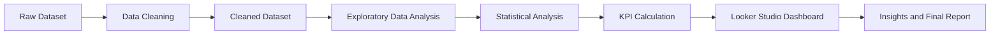

# CityFlo Bus Service Analytics

## Project Overview

This project analyzes CityFlo-style bus service data across six Indian metro cities.

The analysis focuses on revenue, trip demand, operational performance, delays, cancellations, customer experience, booking behaviour, and payment patterns.

Python was used for data cleaning, exploratory analysis, statistical testing, and KPI calculation. Looker Studio was used to create the final interactive dashboard.

---

## Tools Used

- Python
- Pandas
- NumPy
- Matplotlib
- Seaborn
- SciPy
- Google Colab
- Looker Studio

---

## Dataset Overview

- Total Records: 3,200
- Total Columns: 36
- Metro Cities: 6
- Routes: 60

The project includes both the raw dataset and the cleaned dataset used for analysis.

---

## Project Structure

```text
CityFlo-Bus-Service-Analytics
│
├── Dashboard
│   ├── Page_1_Executive_Overview.jpg
│   ├── Page_2_Revenue_Demand_Analysis.jpg
│   ├── Page_3_Operations_Service_Performance.jpg
│   ├── Page_4_Customer_Booking_Insights.jpg
│   └── Looker_Studio_Dashboard_Link.txt
│
├── Data Analysis
│   └── CityFlo_Bus_Service_Data_Analysis.ipynb
│
├── Data Cleaning
│   └── CityFlo_Bus_Service_Data_Cleaning.ipynb
│
├── Datasets
│   ├── cityflo_bus_service_metro_cities.csv
│   └── cityflo_bus_service_metro_cities_cleaned.csv
│
├── Report
│   └── CityFlo_Bus_Service_Analytics_Final_Report.pdf
│
├── .gitignore
└── README.md
```

---

## Project Workflow



---

## Key Performance Indicators

- Net Revenue: ₹859,623.50
- Total Trips: 3,200
- Unique Customers: 1,251
- Completed Trips: 2,494
- Cancellation Rate: 22.06%
- On-Time Performance: 68.75%
- Average Occupancy: 57.86%
- Average Rating: 3.80
- Complaint Rate: 6.41%

---

## Data Cleaning

The raw dataset was cleaned and prepared before performing the analysis.

The main cleaning steps included:

- Checking dataset structure and data types
- Identifying and handling missing values
- Removing duplicate records
- Verifying numerical and categorical columns
- Creating derived fields required for analysis
- Exporting the final cleaned dataset

Derived fields included:

- Trip Year
- Trip Month
- Trip Weekday
- Delay Minutes
- Delay Status
- Net Revenue
- Age Group

### Data Cleaning Notebook

[View Data Cleaning Notebook](Data%20Cleaning/CityFlo_Bus_Service_Data_Cleaning.ipynb)
---

## Exploratory Data Analysis (EDA)

The cleaned dataset was analyzed to understand trip demand, revenue, service performance, delays, customer behaviour, and booking patterns.

The analysis included:

- Data Verification
- Univariate Analysis
- Bivariate Analysis
- Multivariate Analysis
- Hypothesis Testing
- KPI Analysis
- Dashboard Preparation and Visualisation

### Data Analysis Notebook

[View Data Analysis Notebook](Data%20Analysis/CityFlo_Bus_Service_Data_Analysis.ipynb)

---

## Live Looker Studio Dashboard

[View Interactive Dashboard](https://datastudio.google.com/reporting/9d322950-e68b-4809-adf3-e8bfe69dd5fb)

---

## Dashboard Preview

### Page 1 — Executive Overview


This page provides an overall view of revenue, trip activity, trip status, and bus type performance.

---

### Page 2 — Revenue & Demand Analysis


This page focuses on monthly revenue trends, route-level demand, booking channels, subscription types, and weekday trip demand across cities.

---

### Page 3 — Operations & Service Performance


This page focuses on trip delays, trip status, bus occupancy, service punctuality, and cancellation reasons.

---

### Page 4 — Customer & Booking Insights


This page focuses on customer demographics, ratings, complaints, payment preferences, and booking channel behaviour.

---

## Key Findings

- The dataset contains 3,200 bus trip records across six metro cities.
- Total net revenue was ₹859,623.50.
- Mumbai generated the highest city-level revenue.
- A total of 2,494 trips were completed.
- The overall cancellation rate was 22.06%.
- Customer Request was the most common cancellation reason.
- Overall On-Time Performance was 68.75%.
- Revenue was distributed fairly evenly across booking channels and subscription types.
- The average customer rating was 3.80.
- The complaint rate was 6.41%.
- Customer demand, revenue, operational performance, and booking behaviour varied across cities, routes, and service categories.

---

## Dashboard Pages

### Page 1 — Executive Overview

- Monthly Revenue & Trip Volume
- Net Revenue by City
- Trip Status Distribution
- Trip Volume by Bus Type

### Page 2 — Revenue & Demand Analysis

- Monthly Net Revenue Trend
- Route Demand vs Net Revenue
- Net Revenue by Booking Channel
- Revenue Contribution by Subscription Type
- Trip Demand by City & Weekday

### Page 3 — Operations & Service Performance

- Average Delay by City
- Trip Status by City
- Bus Type Occupancy & Delay
- Trip Delay Status
- Cancellation Reasons

### Page 4 — Customer & Booking Insights

- Gender Mix by Age Group
- Customer Rating Distribution
- Customer Experience by City
- Payment Mode Usage
- Payment Modes by Booking Channel

---

## Project Report

The complete project report contains the project methodology, data preparation, analysis, KPIs, dashboard findings, recommendations, limitations, and conclusion.

[View Full Project Report](Report/CityFlo_Bus_Service_Analytics_Final_Report.pdf)

---

## Author

**Rosmi Koley**
