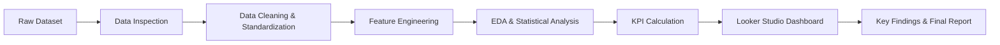
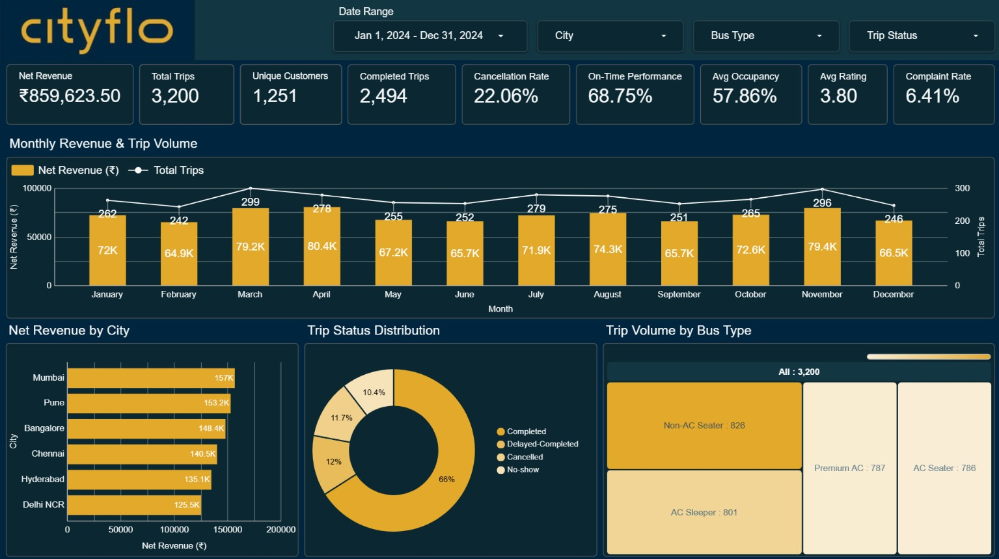
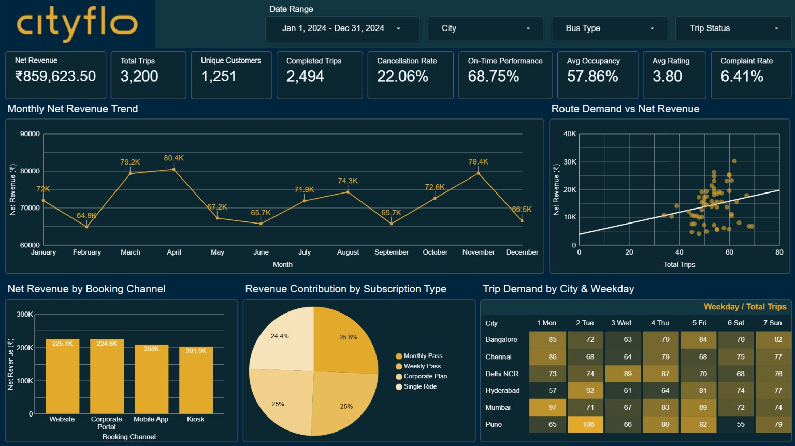
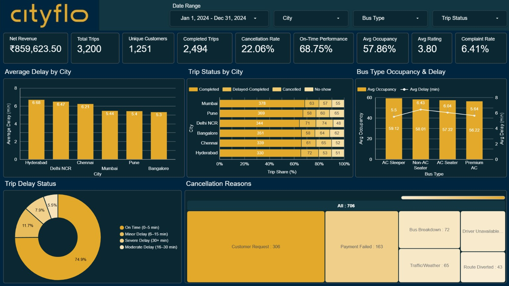
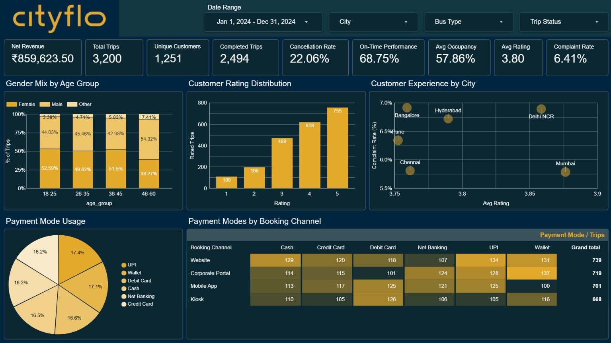

# CityFlo Bus Service Analytics

## Project Overview

This project analyzes CityFlo-style bus service data across six Indian metro cities.

The analysis focuses on revenue, trip demand, operational performance, delays, cancellations, customer experience, booking behaviour, and payment patterns.

Python was used for data cleaning, exploratory analysis, statistical testing, and KPI calculation. Looker Studio was used to create the final interactive dashboard.

## Quick Links

- [Live Looker Studio Dashboard](https://datastudio.google.com/reporting/9d322950-e68b-4809-adf3-e8bfe69dd5fb)
- [Data Cleaning Notebook](Data%20Cleaning/CityFlo_Bus_Service_Data_Cleaning.ipynb)
- [Data Analysis Notebook](Data%20Analysis/CityFlo_Bus_Service_Data_Analysis.ipynb)
- [Full Project Report](Report/Cityflo_Bus_Service_Metro_Cities_Analytics_Report.pdf)

---

## Tools Used

- Python
- Pandas
- NumPy
- Matplotlib
- Seaborn
- SciPy
- Google Colab
- Looker Studio

---

## Dataset Overview

- Total Records: 3,200
- Total Columns: 36
- Metro Cities: 6
- Routes: 60

The project includes both the raw dataset and the cleaned dataset used for analysis.

---

## Project Workflow



The project followed an end-to-end analytics workflow, starting with raw data inspection and cleaning, followed by feature engineering, exploratory and statistical analysis, KPI calculation, dashboard development, and final business insights.

---

### Workflow Summary

**Data Preparation:** Raw data was inspected, cleaned, standardized, and enhanced with derived fields required for analysis.

**Data Analysis:** Univariate, bivariate, and multivariate analysis were performed along with statistical testing and KPI calculation.

**Dashboard & Reporting:** The analyzed data was transformed into a four-page Looker Studio dashboard, followed by key business insights and the final project report.

---

## Data Cleaning

The raw dataset contained duplicate records, missing values, inconsistent category labels, mixed data types, extra spaces, and a few invalid or unrealistic values.

The main cleaning steps included:

- Removed duplicate trip records.
- Cleaned extra spaces and standardized inconsistent text and category values.
- Converted fare and other numerical columns into proper numeric formats.
- Standardized boolean fields such as peak-hour, GPS, and complaint indicators.
- Handled missing values using suitable methods such as median values or zero where appropriate.
- Checked and corrected unrealistic values such as invalid ages, occupancy percentages, and fares.
- Removed unnecessary columns that were not required for the analysis.
- Converted trip dates into proper date format.
- Created useful derived fields for further analysis.

The derived fields included `trip_year`, `trip_month`, `trip_weekday`, `delay_minutes`, `is_delayed`, `net_revenue_inr`, and `age_group`.

### Data Cleaning Notebook

[View Data Cleaning Notebook](Data%20Cleaning/CityFlo_Bus_Service_Data_Cleaning.ipynb)

---

## Exploratory Data Analysis (EDA)

The cleaned dataset was analyzed to understand patterns in trip demand, revenue, fare, delays, occupancy, customer ratings, and service performance.

### Univariate Analysis
Individual variables were examined using histograms, box plots, summary statistics, frequency counts, and categorical charts. Numerical features such as age, distance, fare, delay, occupancy, and net revenue were analyzed along with categories such as city, bus type, and trip status.

### Bivariate Analysis
Relationships between two variables were studied using:
- Fare vs Distance
- Fare by Bus Type
- Average Rating by City
- Trip Status by City

### Multivariate Analysis
Multiple variables were analyzed together using pair plots, correlation heatmaps, city and bus-type comparisons, and city-wise delay distributions.

### Statistical Analysis
Statistical tests were performed to validate selected relationships:
- Pearson Correlation — Distance and Fare
- Independent t-test — Peak Hour and Trip Delay
- One-Way ANOVA — Bus Type and Fare
- Chi-Square Test — City and Trip Status

### Data Analysis Notebook

[View Data Analysis Notebook](Data%20Analysis/CityFlo_Bus_Service_Data_Analysis.ipynb)

---

## Key Performance Indicators

| KPI | Value |
|---|---:|
| Net Revenue | ₹859,623.50 |
| Total Trips | 3,200 |
| Unique Customers | 1,251 |
| Completed Trips | 2,494 |
| Cancellation Rate | 22.06% |
| On-Time Performance | 68.75% |
| Average Occupancy | 57.86% |
| Average Rating | 3.80 |
| Complaint Rate | 6.41% |

---

## Live Looker Studio Dashboard

[View Interactive Dashboard](https://datastudio.google.com/reporting/9d322950-e68b-4809-adf3-e8bfe69dd5fb)

---

## Dashboard Preview

### Page 1 — Executive Overview



This page provides an overall view of revenue, trip activity, trip status, and bus type performance.

**Includes:**
- Monthly Revenue & Trip Volume
- Net Revenue by City
- Trip Status Distribution
- Trip Volume by Bus Type

---

### Page 2 — Revenue & Demand Analysis



This page focuses on revenue trends and demand patterns across routes, booking channels, subscription types, cities, and weekdays.

**Includes:**
- Monthly Net Revenue Trend
- Route Demand vs Net Revenue
- Net Revenue by Booking Channel
- Revenue Contribution by Subscription Type
- Trip Demand by City & Weekday

---

### Page 3 — Operations & Service Performance



This page analyzes service performance using trip delays, trip status, occupancy, punctuality, and cancellation information.

**Includes:**
- Average Delay by City
- Trip Status by City
- Bus Type Occupancy & Delay
- Trip Delay Status
- Cancellation Reasons

---

### Page 4 — Customer & Booking Insights



This page focuses on customer demographics, ratings, complaints, payment preferences, and booking behaviour.

**Includes:**
- Gender Mix by Age Group
- Customer Rating Distribution
- Customer Experience by City
- Payment Mode Usage
- Payment Modes by Booking Channel

---

## Key Findings

- Total net revenue reached ₹859,623.50, with Mumbai generating the highest city-level revenue.
- 2,494 of 3,200 trips were completed, while the overall cancellation rate was 22.06%.
- Customer Request was the most common cancellation reason.
- Overall On-Time Performance was 68.75%.
- Revenue was distributed fairly evenly across booking channels and subscription types.
- Average customer rating was 3.80, with a complaint rate of 6.41%.
- Revenue, demand, and operational performance varied across cities, routes, and service categories.

---

## Project Structure

```text
CityFlo-Bus-Service-Analytics
│
├── Dashboard
│   ├── Page_1_Executive_Overview.jpg
│   ├── Page_2_Revenue_Demand_Analysis.jpg
│   ├── Page_3_Operations_Service_Performance.jpg
│   ├── Page_4_Customer_Booking_Insights.jpg
│   └── Looker_Studio_Dashboard_Link.txt
│
├── Data Analysis
│   └── CityFlo_Bus_Service_Data_Analysis.ipynb
│
├── Data Cleaning
│   └── CityFlo_Bus_Service_Data_Cleaning.ipynb
│
├── Datasets
│   ├── cityflo_bus_service_metro_cities.csv
│   └── cityflo_bus_service_metro_cities_cleaned.csv
│
├── Report
│   └── CityFlo_Bus_Service_Analytics_Final_Report.pdf
│
├── .gitignore
└── README.md
```

---

## Project Report

The complete project report contains the project methodology, data preparation, analysis, KPIs, dashboard findings, recommendations, limitations, and conclusion.

[View Full Project Report](Report/Cityflo_Bus_Service_Metro_Cities_Analytics_Report.pdf)

---

## Author

**Rosmi Koley**
